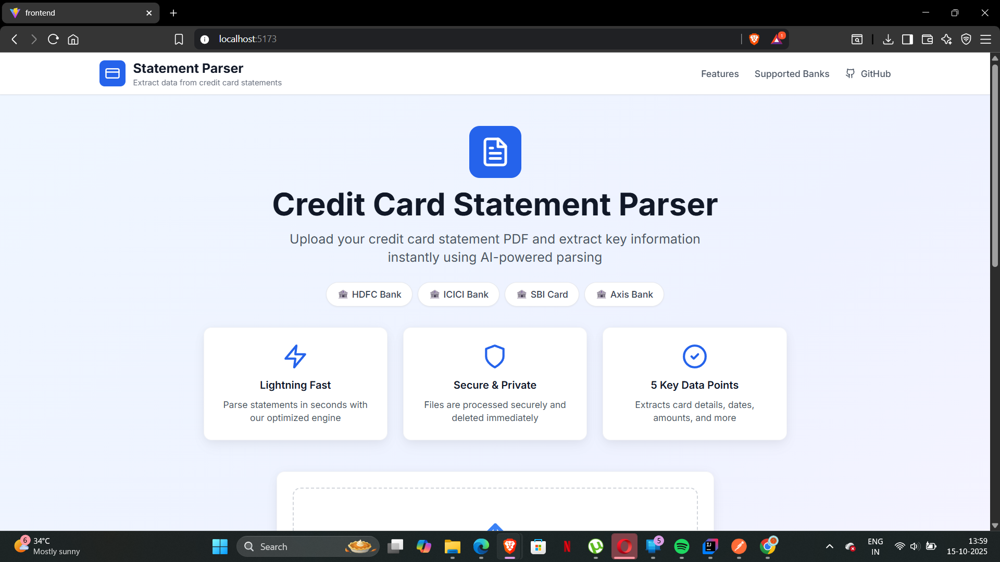
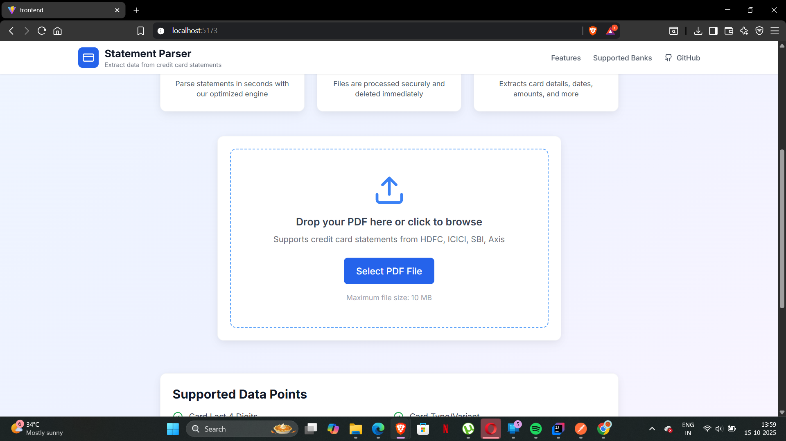
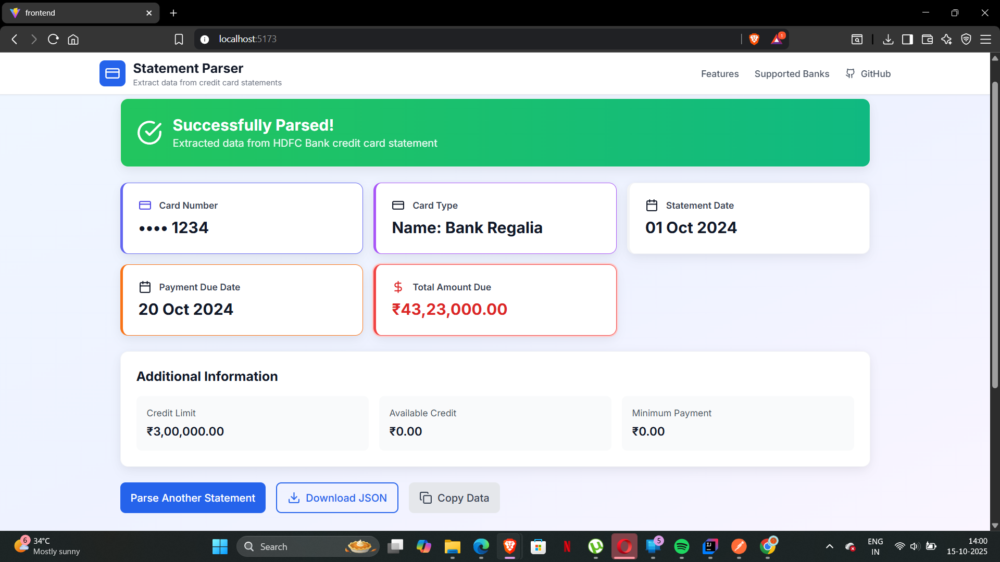

This is an Java Springboot project made using maven for the backend and React for the frontend

Built a PDF parser that can automatically extract structured data from credit card statements across multiple issuers.
Multi Issuer Support
HDFC Bank
ICICI Bank
SBI Card
Axis Bank

Data Extraction 

Card Details (card variant/type, last 4 digits)
Billing Information (billing cycle dates, statement date)
Payment Details (due date, minimum amount due, total outstanding)
Account Information (credit limit, available credit)

Frontend running on port 5173

command to run frontend : npm run dev

Backend running on port 8080

command to run backend : mvn spring-boot:run

